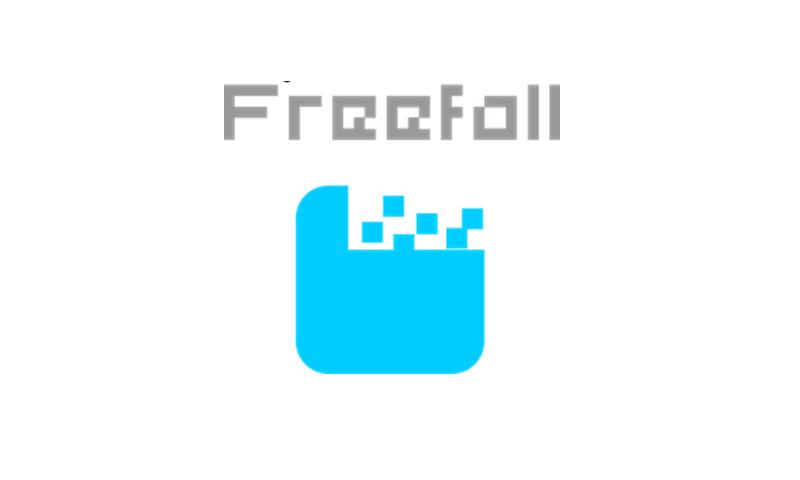
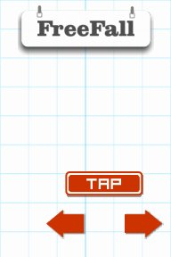
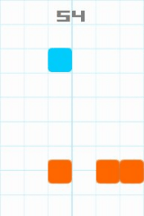

## About
Freefall is a mobile game that will test your quick responses and keep you engaged in endless fun of dodging obstacles and amassing points through wit and power-ups.

The game is currently available on [itch.io](http://phyrebotcentral.itch.io/freefall) and [Amazon](http://www.amazon.com/Phyrebotcentral-Freefall/dp/B0105SPD1M/ref=sr_1_1?s=mobile-apps&ie=UTF8&qid=1435614166&sr=1-1&keywords=phyrebotcentral&pebp=1435646545991&perid=188PP7Q1FK4HTWFFA5MJ) for android for free and without ads. I'm planning to make it available for free on Google Play and without ads.

## Screenshots
 
 

## License
Freefall is licensed under the [MIT License](license.txt)

## Website
www.phyrebotcentral.com
